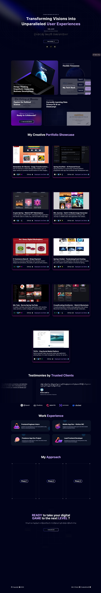

# Min's Professional Developer Portfolio
LIVE URL: https://www.minkkhant.com

---
## 📝 Overview
Welcome to my personal developer portfolio, where innovative design meets professional experience. Dive into a world where each click and scroll reveals a part of my journey as a developer, a testament to my technical prowess and innovative approach to modern web development.

---

## Table of Contents 📋

1. [Demo](#demo)
2. [Features](#features)
3. [Tech-Stacks](#tech-stacks)
4. [Installation](#installation)
5. [License](#license)
6. [Acknowledgement](#acknowledgement)

---
## Demo
# 🌐 
Deployed URL: https://www.minkkhant.com

---
## Features
# ✨ 
#### Hero Section

- **Engaging Introduction**: A dynamic hero section with a spotlight effect that draws attention to the central theme of my developer journey.
- **Background Animation**: A subtle yet captivating animation that sets a professional tone for the portfolio.

#### Bento Grid

- **Modern Bento Grid**: Discover my personal information laid out in a **modern Bento Grid**. This section showcases cutting-edge CSS design techniques that bring my story to life.
- **CSS Mastery**: Demonstrates advanced CSS techniques through a structured layout that presents personal and professional information in an accessible format.

#### 3D Elements

- **Interactive Experience**: Incorporates interactive 3D elements like a GitHub-inspired globe, showcasing my ability to create immersive web experiences.
- **Card Hover Effects**: Utilizes Three.js to add depth to UI elements, enhancing user engagement through visual feedback.

#### Testimonials

- **Client Feedback**: Features a dynamic testimonials section with auto-scrolling content, highlighting positive feedback and endorsements.

#### Work Experience

- **Professional Timeline**: A detailed display of my work history, emphasizing significant achievements and roles for credibility.

#### Canvas Effect

- **HTML5 Canvas**: Be amazed by the innovative use of HTML5 canvas in the "approaches" section, creating **visually striking effects** that illustrate my technical abilities.

#### Responsiveness

- **Adaptive Design**: Ensures a consistent user experience across all devices, showcasing my commitment to responsive design principles. Enjoy a seamless experience across all devices, thanks to the site's adaptability, ensuring an **optimal viewing experience** for every user.

---
## Tech-Stacks
# 🚀

The project is built using the following technologies:

- **Next.js**: Utilized for its comprehensive rendering capabilities and its efficiency in building user interfaces.
- **Three.js**: Employed to create and manipulate 3D content, demonstrating my expertise in visual computing.
- **Framer Motion**: Integrated for its powerful animation tools, adding a layer of sophistication to UI interactions.
- **TailwindCSS**: Chosen for its utility-first approach, enabling rapid and maintainable CSS styling.

---
## Installation
# 🛠️

To run the app locally, follow these steps:

Clone the repository: git clone https://github.com/<your-username>/image-transformer.git
Install the dependencies: npm install
Run the development server: npm run dev

Open http://localhost:3000 with your browser to see the result.

---
## License
# 📖

Min's**Professional Developer Portfolio** is open source and licensed under the MIT license. You can find the code base and the README file on GitHub. I welcome any feedback, suggestions, or contributions to improve the project and make it more useful for the community.

---
## Feedback

If you have any feedback, suggestions, or questions, feel free to contact me at min@mandalaymorningstar.com or open an issue on GitHub. I would love to hear from you and improve the project. Thank you for using and supporting the web app.

---
## Acknowledgement
# 🙏

This project is inspired by JS Mastery and the Burmese Spring Revolution Civil Disobedience Movement. The project aims to support the cause of democracy and human rights in Myanmar through cutting-edge web development tech stacks.

GitHub: https://github.com/min-hinthar 
Email: min@mandalaymorningstar.com 
LinkedIn: https://www.linkedin.com/in/minkkhant93/ 
Portfolio: https://minkkhant-portfolio.netlify.app/ 

---